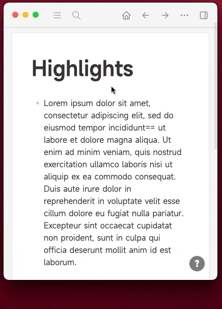
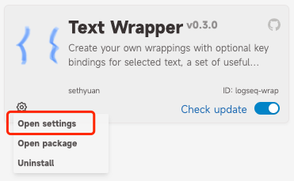

中文 | [English](README.en.md)

# logseq-plugin-wrap

创建自定义文字包围/替换及快捷键，默认提供了一组实用的配置。

## 使用展示

https://user-images.githubusercontent.com/3410293/234194368-cd438917-e6d4-47f4-bd74-9208baed2575.mp4



## 用户配置



```json
{
  "disabled": false,
  "toolbar": true,
  "toolbarShortcut": "",
  "group-ref": {
    "wrap-pageref": {
      "label": "Page ref",
      "binding": "",
      "template": "[[$^]]",
      "icon": "<svg t=\"1648603043979\" viewBox=\"0 0 1024 1024\" version=\"1.1\" xmlns=\"http://www.w3.org/2000/svg\" p-id=\"3931\" width=\"200\" height=\"200\"><path d=\"M431.488 205.824c20.48 0 37.12-17.408 37.12-38.912A38.08 38.08 0 0 0 431.552 128H357.12C336.64 128 320 145.408 320 166.912v635.328c0 21.504 16.64 38.912 37.12 38.912h74.368c20.48 0 37.12-17.408 37.12-38.912a38.08 38.08 0 0 0-37.12-38.912h-37.12V205.824h37.12zM687.488 205.824c20.48 0 37.12-17.408 37.12-38.912a38.08 38.08 0 0 0-37.12-38.912H613.12C592.64 128 576 145.408 576 166.912v635.328c0 21.504 16.64 38.912 37.12 38.912h74.368c20.48 0 37.12-17.408 37.12-38.912a38.08 38.08 0 0 0-37.12-38.912h-37.12V205.824h37.12z\" fill=\"#eee\" p-id=\"3932\"></path></svg>"
    },
    "wrap-link": {
      "label": "Link",
      "binding": "",
      "template": "[$^]()",
      "icon": "<svg t=\"1682390611487\" viewBox=\"0 0 1024 1024\" version=\"1.1\" xmlns=\"http://www.w3.org/2000/svg\" p-id=\"2024\" width=\"200\" height=\"200\"><path d=\"M574 665.4c-3.1-3.1-8.2-3.1-11.3 0L446.5 781.6c-53.8 53.8-144.6 59.5-204 0-59.5-59.5-53.8-150.2 0-204l116.2-116.2c3.1-3.1 3.1-8.2 0-11.3l-39.8-39.8c-3.1-3.1-8.2-3.1-11.3 0L191.4 526.5c-84.6 84.6-84.6 221.5 0 306s221.5 84.6 306 0l116.2-116.2c3.1-3.1 3.1-8.2 0-11.3L574 665.4zM832.6 191.4c-84.6-84.6-221.5-84.6-306 0L410.3 307.6c-3.1 3.1-3.1 8.2 0 11.3l39.7 39.7c3.1 3.1 8.2 3.1 11.3 0l116.2-116.2c53.8-53.8 144.6-59.5 204 0 59.5 59.5 53.8 150.2 0 204L665.3 562.6c-3.1 3.1-3.1 8.2 0 11.3l39.8 39.8c3.1 3.1 8.2 3.1 11.3 0l116.2-116.2c84.5-84.6 84.5-221.5 0-306.1z\" p-id=\"2025\" fill=\"#eeeeee\"></path><path d=\"M610.1 372.3c-3.1-3.1-8.2-3.1-11.3 0L372.3 598.7c-3.1 3.1-3.1 8.2 0 11.3l39.6 39.6c3.1 3.1 8.2 3.1 11.3 0l226.4-226.4c3.1-3.1 3.1-8.2 0-11.3l-39.5-39.6z\" p-id=\"2026\" fill=\"#eeeeee\"></path></svg>"
    }
  },
  "group-semantic": {
    "wrap-code": {
      "label": "Inline code",
      "binding": "",
      "template": "`$^`",
      "icon": "<svg xmlns=\"http://www.w3.org/2000/svg\"><text stroke=\"#000\" stroke-width=\"0\" x=\"6\" y=\"22\" font-size=\"24\" font-family=\"Noto Sans JP\" xml:space=\"preserve\" fill=\"#eee\">`</text></svg>"
    },
    "wrap-caption": {
      "label": "Caption",
      "binding": "",
      "template": "[[#caption]]==$^==",
      "icon": "<svg t=\"1690249238216\" class=\"icon\" viewBox=\"0 0 1024 1024\" version=\"1.1\" xmlns=\"http://www.w3.org/2000/svg\" p-id=\"4930\" width=\"200\" height=\"200\"><path d=\"M128 213.333333v597.333334h768V213.333333H128zM42.666667 213.333333a85.333333 85.333333 0 0 1 85.333333-85.333333h768a85.333333 85.333333 0 0 1 85.333333 85.333333v597.333334a85.333333 85.333333 0 0 1-85.333333 85.333333H128a85.333333 85.333333 0 0 1-85.333333-85.333333V213.333333z m170.666666 469.333334a42.666667 42.666667 0 0 0 0 85.333333h597.333334a42.666667 42.666667 0 0 0 0-85.333333H213.333333z\" p-id=\"4931\" fill=\"#eee\"></path></svg>"
    }
  },
  "group-style": {
    "wrap-bold": {
      "label": "Bold",
      "binding": "",
      "template": "**$^**",
      "icon": "<svg t=\"1644033307902\" viewBox=\"0 0 1024 1024\" version=\"1.1\" xmlns=\"http://www.w3.org/2000/svg\" p-id=\"1224\" width=\"200\" height=\"200\"><path d=\"M697.8 481.4c33.6-35 54.2-82.3 54.2-134.3v-10.2C752 229.3 663.9 142 555.3 142H259.4c-15.1 0-27.4 12.3-27.4 27.4v679.1c0 16.3 13.2 29.5 29.5 29.5h318.7c117 0 211.8-94.2 211.8-210.5v-11c0-73-37.4-137.3-94.2-175.1zM328 238h224.7c57.1 0 103.3 44.4 103.3 99.3v9.5c0 54.8-46.3 99.3-103.3 99.3H328V238z m366.6 429.4c0 62.9-51.7 113.9-115.5 113.9H328V542.7h251.1c63.8 0 115.5 51 115.5 113.9v10.8z\" p-id=\"1225\" fill=\"#eee\"></path></svg>"
    },
    "wrap-italic": {
      "label": "Italic",
      "binding": "",
      "template": "*$^*",
      "icon": "<svg t=\"1644033462513\" viewBox=\"0 0 1024 1024\" version=\"1.1\" xmlns=\"http://www.w3.org/2000/svg\" p-id=\"2021\" width=\"200\" height=\"200\"><path d=\"M382.72 810.666667L542.72 213.333333H426.666667a42.666667 42.666667 0 1 1 0-85.333333h341.333333a42.666667 42.666667 0 0 1 0 85.333333h-136.874667L471.04 810.666667H597.333333a42.666667 42.666667 0 0 1 0 85.333333H256a42.666667 42.666667 0 0 1 0-85.333333h126.72z\" fill=\"#eee\" p-id=\"2022\"></path></svg>"
    },
    "wrap-strike-through": {
      "label": "Strike through",
      "binding": "",
      "template": "~~$^~~",
      "icon": "<svg t=\"1647222242775\" viewBox=\"0 0 1024 1024\" version=\"1.1\" xmlns=\"http://www.w3.org/2000/svg\" p-id=\"1518\" width=\"200\" height=\"200\"><path d=\"M1014.869333 468.650667H578.161778c-11.406222-2.275556-23.409778-4.579556-36.124445-6.855111a2110.094222 2110.094222 0 0 1-35.185777-6.627556c-58.624-11.434667-93.923556-22.869333-122.026667-39.111111-40.135111-23.409778-59.676444-55.182222-59.676445-97.251556 0-42.268444 17.351111-77.368889 50.289778-101.717333 32.426667-23.978667 78.620444-36.693333 133.489778-36.693333 62.606222 0 110.933333 16.497778 143.758222 48.924444a144.839111 144.839111 0 0 1 36.352 60.131556c1.479111 4.664889 3.185778 11.406222 4.892445 20.337777 1.052444 5.489778 5.973333 9.386667 11.320889 9.386667h83.2a11.576889 11.576889 0 0 0 11.548444-11.576889v-1.137778a268.629333 268.629333 0 0 0-2.275556-18.289777C789.333333 238.478222 765.724444 194.844444 729.486222 162.133333c-50.744889-46.307556-125.383111-70.627556-215.665778-70.627555-82.631111 0-157.013333 20.679111-209.464888 58.168889-29.269333 21.048889-51.911111 47.075556-66.986667 77.368889-15.416889 30.976-23.210667 66.730667-23.210667 106.154666 0 33.735111 6.542222 62.293333 19.797334 87.438222 9.472 17.92 22.385778 33.706667 38.968888 48.014223H9.102222a9.159111 9.159111 0 0 0-9.130666 9.130666v68.551111c0 5.034667 4.124444 9.159111 9.130666 9.159112h495.104l6.741334 1.365333c35.299556 7.111111 56.576 11.889778 76.117333 17.379555 26.282667 7.424 46.392889 15.217778 63.089778 24.576 40.903111 23.096889 60.899556 56.234667 60.899555 101.717334 0 40.334222-17.720889 76.344889-49.834666 101.489778-34.844444 27.306667-86.385778 41.585778-149.134223 41.585777-49.948444 0-92.216889-9.699556-125.952-28.558222-33.251556-18.631111-56.092444-45.511111-68.209777-79.445333a122.965333 122.965333 0 0 1-3.100445-10.268445 11.690667 11.690667 0 0 0-11.093333-8.590222H212.707556a11.576889 11.576889 0 0 0-11.548445 11.548445v1.137777c0.227556 2.645333 0.483556 4.835556 0.711111 6.542223 7.395556 55.751111 34.616889 101.461333 80.782222 135.765333 53.845333 39.765333 129.592889 60.785778 219.192889 60.785778 96.227556 0 176.924444-22.613333 233.386667-65.479111a215.893333 215.893333 0 0 0 65.251556-78.876445c14.848-30.947556 22.528-66.161778 22.528-104.561778 0-36.323556-6.627556-66.730667-20.366223-93.013333a157.184 157.184 0 0 0-24.888889-35.214222h237.141334a9.159111 9.159111 0 0 0 9.130666-9.130667v-68.579555a9.159111 9.159111 0 0 0-9.130666-9.016889z\" p-id=\"1519\" fill=\"#eee\"></path></svg>"
    },
    "wrap-math": {
      "label": "Math expression",
      "binding": "",
      "template": "$$^$",
      "icon": "<svg t=\"1671082671586\" viewBox=\"0 0 1024 1024\" version=\"1.1\" xmlns=\"http://www.w3.org/2000/svg\" p-id=\"3424\" width=\"200\" height=\"200\"><path d=\"M725.333333 853.333333H256c-17.066667 0-29.866667-8.533333-38.4-25.6-8.533333-17.066667-4.266667-34.133333 4.266667-46.933333l230.4-268.8-230.4-268.8c-8.533333-12.8-12.8-34.133333-4.266667-46.933333 8.533333-17.066667 21.333333-25.6 38.4-25.6h469.333333c46.933333 0 85.333333 38.4 85.333334 85.333333v85.333333c0 25.6-17.066667 42.666667-42.666667 42.666667s-42.666667-17.066667-42.666667-42.666667V256H349.866667l196.266666 226.133333c12.8 17.066667 12.8 38.4 0 55.466667L349.866667 768H725.333333v-85.333333c0-25.6 17.066667-42.666667 42.666667-42.666667s42.666667 17.066667 42.666667 42.666667v85.333333c0 46.933333-38.4 85.333333-85.333334 85.333333z\" p-id=\"3425\" fill=\"#eee\"></path></svg>"
    }
  },
  "group-hl": {
    "wrap-yellow-hl": {
      "label": "Highlight",
      "binding": "",
      "template": "==$^==",
      "icon": "<svg t=\"1643262039637\" viewBox=\"0 0 1024 1024\" version=\"1.1\" xmlns=\"http://www.w3.org/2000/svg\" p-id=\"6950\" xmlns:xlink=\"http://www.w3.org/1999/xlink\" width=\"200\" height=\"200\"><defs><style type=\"text/css\"></style></defs><path d=\"M114.727313 1024l0.305421-0.427589h-0.977347l0.671926 0.427589zM632.721199 809.365446c-156.680934 0-272.466006 41.644143-341.659116 75.927642L290.878831 972.108985C340.402833 942.605324 458.249497 885.720677 632.73647 885.720677H962.804862v-76.355231H632.73647z m-109.432317-72.018253l252.048617-528.378197a38.177615 38.177615 0 0 0-13.621773-48.790993L551.295981 24.464216a38.192886 38.192886 0 0 0-50.089031 7.696607L130.349594 483.908911a38.208157 38.208157 0 0 0-7.024682 35.886958c31.763776 100.315502 36.436716 182.626441 34.695817 234.777064L94.477906 870.449631h132.094549l32.221908-42.606219c49.78361-25.624815 134.15614-60.931474 233.326314-69.177839a38.147073 38.147073 0 0 0 31.152934-21.31838z m-59.343285-52.54767c-71.66702 8.505973-134.950235 28.572127-184.489509 49.157497l-45.339736-29.244053c-2.290657-50.883126-10.613377-114.716099-31.901215-187.849139l336.161539-409.874879 153.474014 98.986922-193.728492 408.653195-176.838714-112.746134-47.935814 60.015211 191.117142 121.847678-0.519215 1.053702z\" p-id=\"6951\" fill=\"#ffe79a\"></path></svg>"
    },
    "wrap-red-hl": {
      "label": "Red highlight",
      "binding": "",
      "template": "[[#red]]==$^==",
      "icon": "<svg t=\"1643262039637\" viewBox=\"0 0 1024 1024\" version=\"1.1\" xmlns=\"http://www.w3.org/2000/svg\" p-id=\"6950\" xmlns:xlink=\"http://www.w3.org/1999/xlink\" width=\"200\" height=\"200\"><defs><style type=\"text/css\"></style></defs><path d=\"M114.727313 1024l0.305421-0.427589h-0.977347l0.671926 0.427589zM632.721199 809.365446c-156.680934 0-272.466006 41.644143-341.659116 75.927642L290.878831 972.108985C340.402833 942.605324 458.249497 885.720677 632.73647 885.720677H962.804862v-76.355231H632.73647z m-109.432317-72.018253l252.048617-528.378197a38.177615 38.177615 0 0 0-13.621773-48.790993L551.295981 24.464216a38.192886 38.192886 0 0 0-50.089031 7.696607L130.349594 483.908911a38.208157 38.208157 0 0 0-7.024682 35.886958c31.763776 100.315502 36.436716 182.626441 34.695817 234.777064L94.477906 870.449631h132.094549l32.221908-42.606219c49.78361-25.624815 134.15614-60.931474 233.326314-69.177839a38.147073 38.147073 0 0 0 31.152934-21.31838z m-59.343285-52.54767c-71.66702 8.505973-134.950235 28.572127-184.489509 49.157497l-45.339736-29.244053c-2.290657-50.883126-10.613377-114.716099-31.901215-187.849139l336.161539-409.874879 153.474014 98.986922-193.728492 408.653195-176.838714-112.746134-47.935814 60.015211 191.117142 121.847678-0.519215 1.053702z\" p-id=\"6951\" fill=\"#ffc7c7\"></path></svg>"
    },
    "wrap-green-hl": {
      "label": "Green highlight",
      "binding": "",
      "template": "[[#green]]==$^==",
      "icon": "<svg t=\"1643262039637\" viewBox=\"0 0 1024 1024\" version=\"1.1\" xmlns=\"http://www.w3.org/2000/svg\" p-id=\"6950\" xmlns:xlink=\"http://www.w3.org/1999/xlink\" width=\"200\" height=\"200\"><defs><style type=\"text/css\"></style></defs><path d=\"M114.727313 1024l0.305421-0.427589h-0.977347l0.671926 0.427589zM632.721199 809.365446c-156.680934 0-272.466006 41.644143-341.659116 75.927642L290.878831 972.108985C340.402833 942.605324 458.249497 885.720677 632.73647 885.720677H962.804862v-76.355231H632.73647z m-109.432317-72.018253l252.048617-528.378197a38.177615 38.177615 0 0 0-13.621773-48.790993L551.295981 24.464216a38.192886 38.192886 0 0 0-50.089031 7.696607L130.349594 483.908911a38.208157 38.208157 0 0 0-7.024682 35.886958c31.763776 100.315502 36.436716 182.626441 34.695817 234.777064L94.477906 870.449631h132.094549l32.221908-42.606219c49.78361-25.624815 134.15614-60.931474 233.326314-69.177839a38.147073 38.147073 0 0 0 31.152934-21.31838z m-59.343285-52.54767c-71.66702 8.505973-134.950235 28.572127-184.489509 49.157497l-45.339736-29.244053c-2.290657-50.883126-10.613377-114.716099-31.901215-187.849139l336.161539-409.874879 153.474014 98.986922-193.728492 408.653195-176.838714-112.746134-47.935814 60.015211 191.117142 121.847678-0.519215 1.053702z\" p-id=\"6951\" fill=\"#ccffc1\"></path></svg>"
    },
    "wrap-blue-hl": {
      "label": "Blue highlight",
      "binding": "",
      "template": "[[#blue]]==$^==",
      "icon": "<svg t=\"1643262039637\" viewBox=\"0 0 1024 1024\" version=\"1.1\" xmlns=\"http://www.w3.org/2000/svg\" p-id=\"6950\" xmlns:xlink=\"http://www.w3.org/1999/xlink\" width=\"200\" height=\"200\"><defs><style type=\"text/css\"></style></defs><path d=\"M114.727313 1024l0.305421-0.427589h-0.977347l0.671926 0.427589zM632.721199 809.365446c-156.680934 0-272.466006 41.644143-341.659116 75.927642L290.878831 972.108985C340.402833 942.605324 458.249497 885.720677 632.73647 885.720677H962.804862v-76.355231H632.73647z m-109.432317-72.018253l252.048617-528.378197a38.177615 38.177615 0 0 0-13.621773-48.790993L551.295981 24.464216a38.192886 38.192886 0 0 0-50.089031 7.696607L130.349594 483.908911a38.208157 38.208157 0 0 0-7.024682 35.886958c31.763776 100.315502 36.436716 182.626441 34.695817 234.777064L94.477906 870.449631h132.094549l32.221908-42.606219c49.78361-25.624815 134.15614-60.931474 233.326314-69.177839a38.147073 38.147073 0 0 0 31.152934-21.31838z m-59.343285-52.54767c-71.66702 8.505973-134.950235 28.572127-184.489509 49.157497l-45.339736-29.244053c-2.290657-50.883126-10.613377-114.716099-31.901215-187.849139l336.161539-409.874879 153.474014 98.986922-193.728492 408.653195-176.838714-112.746134-47.935814 60.015211 191.117142 121.847678-0.519215 1.053702z\" p-id=\"6951\" fill=\"#abdfff\"></path></svg>"
    }
  },
  "group-text": {
    "wrap-red-text": {
      "label": "Red text",
      "binding": "",
      "template": "[[$red]]==$^==",
      "icon": "<svg t=\"1643270432116\" class=\"icon\" viewBox=\"0 0 1024 1024\" version=\"1.1\" xmlns=\"http://www.w3.org/2000/svg\" p-id=\"12761\" width=\"200\" height=\"200\"><path d=\"M256 768h512a85.333333 85.333333 0 0 1 85.333333 85.333333v42.666667a85.333333 85.333333 0 0 1-85.333333 85.333333H256a85.333333 85.333333 0 0 1-85.333333-85.333333v-42.666667a85.333333 85.333333 0 0 1 85.333333-85.333333z m0 85.333333v42.666667h512v-42.666667H256z m401.578667-341.333333H366.421333L298.666667 682.666667H213.333333l256.128-640H554.666667l256 640h-85.333334l-67.754666-170.666667z m-33.877334-85.333333L512 145.365333 400.298667 426.666667h223.402666z\" p-id=\"12762\" fill=\"#f00\"></path></svg>"
    },
    "wrap-green-text": {
      "label": "Green text",
      "binding": "",
      "template": "[[$green]]==$^==",
      "icon": "<svg t=\"1643270432116\" viewBox=\"0 0 1024 1024\" version=\"1.1\" xmlns=\"http://www.w3.org/2000/svg\" p-id=\"12761\" width=\"200\" height=\"200\"><path d=\"M256 768h512a85.333333 85.333333 0 0 1 85.333333 85.333333v42.666667a85.333333 85.333333 0 0 1-85.333333 85.333333H256a85.333333 85.333333 0 0 1-85.333333-85.333333v-42.666667a85.333333 85.333333 0 0 1 85.333333-85.333333z m0 85.333333v42.666667h512v-42.666667H256z m401.578667-341.333333H366.421333L298.666667 682.666667H213.333333l256.128-640H554.666667l256 640h-85.333334l-67.754666-170.666667z m-33.877334-85.333333L512 145.365333 400.298667 426.666667h223.402666z\" p-id=\"12762\" fill=\"#0f0\"></path></svg>"
    },
    "wrap-blue-text": {
      "label": "Blue text",
      "binding": "",
      "template": "[[$blue]]==$^==",
      "icon": "<svg t=\"1643270432116\" class=\"icon\" viewBox=\"0 0 1024 1024\" version=\"1.1\" xmlns=\"http://www.w3.org/2000/svg\" p-id=\"12761\" width=\"200\" height=\"200\"><path d=\"M256 768h512a85.333333 85.333333 0 0 1 85.333333 85.333333v42.666667a85.333333 85.333333 0 0 1-85.333333 85.333333H256a85.333333 85.333333 0 0 1-85.333333-85.333333v-42.666667a85.333333 85.333333 0 0 1 85.333333-85.333333z m0 85.333333v42.666667h512v-42.666667H256z m401.578667-341.333333H366.421333L298.666667 682.666667H213.333333l256.128-640H554.666667l256 640h-85.333334l-67.754666-170.666667z m-33.877334-85.333333L512 145.365333 400.298667 426.666667h223.402666z\" p-id=\"12762\" fill=\"#00beff\"></path></svg>"
    }
  },
  "group-cloze": {
    "wrap-cloze": {
      "label": "Cloze",
      "binding": "",
      "template": " {{cloze $^}}",
      "icon": "<svg t=\"1643261888324\" viewBox=\"0 0 1024 1024\" version=\"1.1\" xmlns=\"http://www.w3.org/2000/svg\" p-id=\"5478\" xmlns:xlink=\"http://www.w3.org/1999/xlink\" width=\"200\" height=\"200\"><defs><style type=\"text/css\"></style></defs><path d=\"M341.333333 396.8V320H170.666667v384h170.666666v-76.8H256V396.8zM682.666667 396.8V320h170.666666v384h-170.666666v-76.8h85.333333V396.8zM535.04 533.333333h40.96v-42.666666h-40.96V203.093333l92.16-24.746666-11.093333-40.96-102.4 27.306666-102.4-27.306666-11.093334 40.96 92.16 24.746666v287.573334H448v42.666666h44.373333v287.573334l-92.16 24.746666 11.093334 40.96 102.4-27.306666 102.4 27.306666 11.093333-40.96-92.16-24.746666z\" p-id=\"5479\" fill=\"#eeeeee\"></path></svg>"
    },
    "wrap-cloze2": {
      "label": "Hidden text",
      "binding": "",
      "template": "[[#cloze]]==$^==",
      "icon": "<svg t=\"1682306531661\" viewBox=\"0 0 1024 1024\" version=\"1.1\" xmlns=\"http://www.w3.org/2000/svg\" p-id=\"1454\" width=\"200\" height=\"200\"><path d=\"M917.333333 573.866667l-87.466666-87.466667c34.133333-32 66.133333-68.266667 91.733333-108.8 8.533333-14.933333 4.266667-34.133333-10.666667-44.8-14.933333-8.533333-34.133333-4.266667-44.8 10.666667-76.8 125.866667-209.066667 200.533333-356.266666 200.533333-145.066667 0-279.466667-74.666667-354.133334-198.4-8.533333-14.933333-29.866667-19.2-44.8-10.666667-14.933333 8.533333-19.2 29.866667-10.666666 44.8 25.6 40.533333 55.466667 76.8 91.733333 108.8l-85.333333 85.333334c-12.8 12.8-12.8 32 0 44.8 6.4 6.4 14.933333 8.533333 23.466666 8.533333s17.066667-2.133333 23.466667-8.533333l91.733333-91.733334c38.4 25.6 81.066667 46.933333 125.866667 59.733334l-34.133333 130.133333c-4.266667 17.066667 6.4 34.133333 23.466666 38.4 2.133333 0 6.4 2.133333 8.533334 2.133333 14.933333 0 27.733333-8.533333 29.866666-23.466666l36.266667-132.266667c25.6 4.266667 51.2 6.4 78.933333 6.4 27.733333 0 55.466667-2.133333 83.2-6.4l36.266667 132.266667c4.266667 14.933333 17.066667 23.466667 29.866667 23.466666 2.133333 0 6.4 0 8.533333-2.133333 17.066667-4.266667 27.733333-21.333333 23.466667-38.4L661.333333 584.533333c44.8-12.8 85.333333-34.133333 123.733334-59.733333l91.733333 91.733333c6.4 6.4 14.933333 8.533333 23.466667 8.533334s17.066667-2.133333 23.466666-8.533334c6.4-10.666667 6.4-29.866667-6.4-42.666666z\" fill=\"#eeeeee\" p-id=\"1455\"></path></svg>"
    }
  },
  "repl-clear": {
    "label": "Remove formatting",
    "binding": "mod+shift+x",
    "regex": "\\[\\[(?:#|\\$)(?:red|green|blue|cloze)\\]\\]|==([^=]*)==|~~([^~]*)~~|\\^\\^([^\\^]*)\\^\\^|\\*\\*([^\\*]*)\\*\\*|\\*([^\\*]*)\\*|_([^_]*)_|\\$([^\\$]*)\\$|`([^`]*)`|\\[([^\\]]*)\\]\\([^\\]]*\\)",
    "replacement": "$1$2$3$4$5$6$7$8$9",
    "icon": "<svg t=\"1643381967522\" viewBox=\"0 0 1024 1024\" version=\"1.1\" xmlns=\"http://www.w3.org/2000/svg\" p-id=\"1377\" width=\"200\" height=\"200\"><path d=\"M824.4 438.8c0-37.6-30-67.6-67.6-67.6l-135.2 0L621.6 104.8c0-37.6-30-67.6-67.6-67.6-37.6 0-67.6 30-67.6 67.6l0 266.4L358.8 371.2c-37.6 0-67.6 30-67.6 67.6l0 67.6L828 506.4l0-67.6L824.4 438.8 824.4 438.8zM824.4 574c-11.2 0-536.8 0-536.8 0S250 972 88.4 972L280 972c75.2 0 108.8-217.6 108.8-217.6s33.6 195.2 3.6 217.6l105.2 0c-3.6 0 0 0 11.2 0 52.4-7.6 60-247.6 60-247.6s52.4 244 45.2 244c-26.4 0-78.8 0-105.2 0l0 0 154 0c-7.6 0 0 0 11.2 0 48.8-11.2 52.4-187.6 52.4-187.6s22.4 187.6 15.2 187.6c-18.8 0-48.8 0-67.6 0l-3.6 0 90 0C895.6 972 903.2 784.4 824.4 574L824.4 574z\" p-id=\"1378\" fill=\"#eeeeee\"></path></svg>"
  }
}
```

在 Logseq 的插件页面打开插件的配置后，有以下几项配置可供使用，请参照上方代码块进行设置（各项的默认值以体现在代码块中）：

- `toolbar`: 不想用工具栏可以设置为`false`。
- `toolbarShortcut`: 设置一个可选快捷键，控制是否显示工具栏。
- `wrap-*`: 自定义的文字包围都定义在这里。你可以扩展默认提供的这些规则，也可以移除或替换你不需要的规则。配置方法请参考上面的示例，`binding`不能出现重复。`template`是你包围文字的模板，里面的`$^`代表原本被选中的文字。
- `repl-*`: 自定义的文字替换都定义在这里。你可以扩展默认提供的这些规则，也可以移除或替换你不需要的规则。配置方法请参考上面的示例，`binding`不能出现重复。`regex`是替换规则的正则表达式，`replacement`描述了要将正则表达式匹配到的文字替换为什么。
- `group-*`: 将多个定义放在同一个组里即可将多个命令在工具条上组合在一起。

## 自定义工具栏样式

请参看下方示例：

```css
/* 工具栏的背景色 */
:root {
  --kef-wrap-tb-bg: #333e;
}
:root.dark {
  --kef-wrap-tb-bg: #777e;
}

/* 这里更改工具栏本身的样式 */
#kef-wrap-toolbar {
  background: #333;
}

/* 这里是工具栏上按钮的样式 */
.kef-wrap-tb-item {
}

/* 这里是工具栏上按钮在有鼠标悬浮时的样式 */
.kef-wrap-tb-item:hover {
  filter: drop-shadow(0 0 3px #fff);
}

/* 这里可以定义svg图标的样式 */
.kef-wrap-tb-item img {
  width: 20px;
  height: 20px;
}
```

内置高亮与文字色的样式如下：

```css
mark {
  background: #fef3ac !important;
  color: #262626 !important;
}
span[data-ref="#red"],
span[data-ref="#green"],
span[data-ref="#blue"],
span[data-ref="$red"],
span[data-ref="$green"],
span[data-ref="$blue"] {
  display: none;
}
span[data-ref="#red"] + mark {
  background: #ffc7c7 !important;
  color: #262626 !important;
}
span[data-ref="#green"] + mark {
  background: #ccffc1 !important;
  color: #262626 !important;
}
span[data-ref="#blue"] + mark {
  background: #abdfff !important;
  color: #262626 !important;
}
span[data-ref="$red"] + mark {
  color: #f00 !important;
  background: unset !important;
  padding: 0;
  border-radius: 0;
}
span[data-ref="$green"] + mark {
  color: #0f0 !important;
  background: unset !important;
  padding: 0;
  border-radius: 0;
}
span[data-ref="$blue"] + mark {
  color: #00f !important;
  background: unset !important;
  padding: 0;
  border-radius: 0;
}
```

## 关于内置的去除格式化

出于技术原因，嵌套的格式不会被去除干净，这种情况下你可以尝试多次去除。

## Buy me a coffee

如果您认为我所开发的软件对您有所帮助，并且愿意给予肯定和支持，不妨扫描下方的二维码进行打赏。感谢您的支持与关注。

 
